# Trabalho Prático: Algoritmos de Clustering
## Análise de Perfis de Risco em Saúde Materna por Clusterização Não Supervisionada

---

## 1. Introdução

O presente trabalho investiga a aplicação de algoritmos de clusterização não supervisionada ao dataset **Maternal Health Risk Data Set**, disponível publicamente no UCI Machine Learning Repository e na plataforma Kaggle. O dataset foi publicado e utilizado no artigo científico de **Ahmed, M., Kashem, M.A., Rahman, M., & Khatun, S. (2020)**. *"Review and Analysis of Risk Factor of Maternal Health in Remote Area Using the Internet of Things (IoT)"*, publicado no *InECCE2019, Lecture Notes in Electrical Engineering, vol 632, Springer*.

### 1.1 Justificativa da Escolha do Dataset

Embora a especificação do trabalho prático liste como exemplos de domínio *Diabetes, Doença Cardiovascular ou Hipertensão*, o dataset **Maternal Health Risk** foi escolhido por ser **diretamente fundamentado nessas mesmas condições clínicas**. Das seis variáveis preditoras do dataset, três são marcadores centrais dessas patologias:

- **SystolicBP e DiastolicBP (Pressão Arterial Sistólica e Diastólica):** São os indicadores primários para diagnóstico de **hipertensão gestacional** e **pré-eclâmpsia** — condições hipertensivas que afetam 5–8% das gestações e representam uma das principais causas de mortalidade materna. Os limiares diagnósticos (PA ≥ 140/90 mmHg) estão diretamente representados nos dados.

- **BS (Blood Sugar — Glicemia):** É o marcador fundamental para diagnóstico de **diabetes mellitus gestacional (DMG)**, condição que acomete 7–14% das gestações. Valores elevados de BS no dataset correspondem diretamente aos critérios diagnósticos de diabetes.

Portanto, apesar de o dataset ter como tema a saúde materna, **as variáveis utilizadas e os perfis de risco investigados são intrinsecamente ligados à hipertensão e ao diabetes** — duas das três condições explicitamente mencionadas na especificação. O clustering aplicado neste trabalho busca, na prática, identificar subgrupos de pacientes com perfis hipertensivos e/ou diabéticos.

Além disso, o dataset atende a todos os critérios técnicos exigidos: é real, possui mais de 1.000 instâncias e foi utilizado em artigo científico publicado.

### 1.2 Definição do Problema

**Tese:** Investigar se algoritmos de clustering não supervisionados conseguem agrupar naturalmente gestantes em perfis de risco (alto, médio, baixo) utilizando exclusivamente métricas fisiológicas — como pressão arterial, níveis de glicose, idade, temperatura corporal e frequência cardíaca — sem que o algoritmo tenha acesso ao diagnóstico prévio.

Essa investigação é relevante porque, caso os algoritmos consigam formar agrupamentos que correspondam aos níveis de risco previamente diagnosticados por especialistas, isso validaria a existência de **padrões fisiológicos naturais** que distinguem gestantes de alto, médio e baixo risco.

**Hipóteses formais:**

- **H1:** Os algoritmos de clusterização formarão agrupamentos que correspondem aos três níveis de risco originais (alto, médio e baixo), indicando que as métricas fisiológicas disponíveis são suficientes para estratificar gestantes.

- **H2:** O cluster de alto risco será o mais distinguível dos três, apresentando a maior pureza na correspondência com o rótulo original, dado que as condições de alto risco (hipertensão severa, diabetes descompensado) envolvem alterações fisiológicas mais pronunciadas.

### 1.3 Descrição do Dataset

O dataset é composto por **1.014 registros** coletados por meio de dispositivos IoT (Internet of Things) e sistemas hospitalares, contendo as seguintes variáveis:

| Variável | Tipo | Descrição |
|---|---|---|
| Age | int | Idade da gestante (anos) |
| SystolicBP | int | Pressão arterial sistólica (mmHg) |
| DiastolicBP | int | Pressão arterial diastólica (mmHg) |
| BS | float | Nível de glicose no sangue (mmol/L) |
| BodyTemp | float | Temperatura corporal (Fahrenheit) |
| HeartRate | int | Frequência cardíaca (bpm) |
| RiskLevel | string | Nível de risco: low risk, mid risk, high risk |

A distribuição original dos rótulos é:

| Nível de Risco | Quantidade | Percentual |
|---|---|---|
| Low Risk | 406 | 40.0% |
| Mid Risk | 336 | 33.1% |
| High Risk | 272 | 26.8% |

> **Nota:** A coluna `RiskLevel` foi utilizada apenas na Análise Descritiva para contextualização e na etapa final de Interpretação para validação dos clusters. Ela foi **removida antes de qualquer etapa de modelagem**, respeitando o caráter não supervisionado dos algoritmos.

---

## 2. Análise Descritiva (EDA)

### 2.1 Análise Univariada

A tabela a seguir resume as estatísticas descritivas de todas as variáveis numéricas:

| Variável | Média | Mediana | Desvio Padrão | Mín | Q1 | Q3 | Máx | IQR |
|---|---|---|---|---|---|---|---|---|
| Age | 29.87 | 26.0 | 13.47 | 10 | 19 | 39 | 70 | 20 |
| SystolicBP | 113.20 | 120.0 | 18.40 | 70 | 100 | 120 | 160 | 20 |
| DiastolicBP | 76.46 | 80.0 | 13.89 | 49 | 65 | 90 | 100 | 25 |
| BS | 8.73 | 7.5 | 3.29 | 6 | 6.9 | 8.0 | 19 | 1.1 |
| BodyTemp | 98.67 | 98.0 | 1.37 | 98 | 98 | 98 | 103 | 0 |
| HeartRate | 74.30 | 76.0 | 8.09 | 7 | 70 | 80 | 90 | 10 |

**Observações-chave da análise univariada:**

- **Age:** Distribuição assimétrica à direita (média > mediana), com amplitude de 10 a 70 anos, indicando grande diversidade etária no dataset.
- **SystolicBP e DiastolicBP:** Apresentam correlação forte entre si (detalhado na análise bivariada). A sistólica concentra-se em torno de 120 mmHg.
- **BS (Glicose):** Fortemente assimétrica à direita, com mediana 7.5 e média 8.73, indicando que a maioria das gestantes apresenta níveis normais, mas há um subgrupo com glicose elevada (até 19 mmol/L).
- **BodyTemp:** Concentração extrema em 98.0 °F, com IQR = 0, indicando baixa variabilidade. Valores acima de 100 °F sugerem condições febris.
- **HeartRate:** Foram identificados **2 registros com HeartRate = 7 bpm**, valores fisiologicamente impossíveis que representam erros de digitação. Esses registros foram tratados na etapa de pré-processamento.

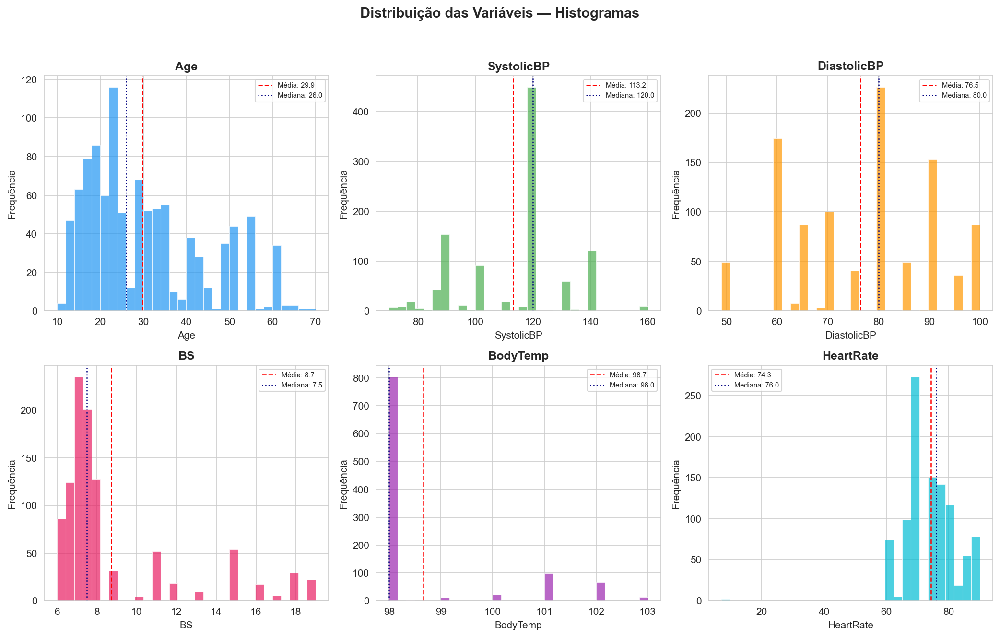

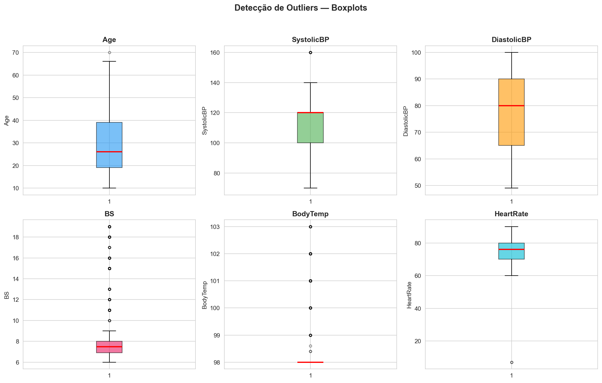

### 2.2 Análise Bivariada

As matrizes de correlação (Pearson e Spearman) revelaram as seguintes relações mais relevantes:

| Par de Variáveis | Pearson | Spearman | Interpretação |
|---|---|---|---|
| SystolicBP × DiastolicBP | **0.787** | **0.757** | Correlação forte e positiva |
| Age × BS | 0.473 | 0.320 | Correlação moderada |
| Age × SystolicBP | 0.416 | 0.485 | Correlação moderada |
| BS × SystolicBP | 0.425 | 0.262 | Correlação moderada |
| BodyTemp × Age | -0.255 | -0.305 | Correlação fraca negativa |
| HeartRate × BS | 0.143 | 0.129 | Correlação negligenciável |

**Observações:**
- A forte correlação entre **SystolicBP e DiastolicBP** (r = 0.787) era esperada clinicamente, pois ambas representam componentes da pressão arterial.
- A correlação moderada entre **Age e BS** (r = 0.473) sugere que gestantes mais velhas tendem a apresentar níveis glicêmicos mais elevados.
- **HeartRate** apresenta correlação fraca com todas as outras variáveis, sugerindo que a frequência cardíaca atua como variável relativamente independente.

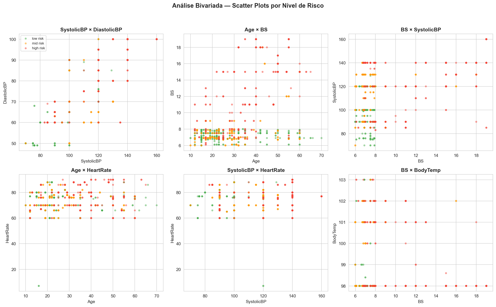

### 2.3 Análise Multivariada

A **Análise de Componentes Principais (PCA)** foi aplicada aos dados padronizados para visualização bidimensional e análise da estrutura de variância do dataset.

O **Scree Plot** (gráfico de variância explicada) mostra a contribuição individual e cumulativa de cada componente principal:

| Componente | Variância Individual | Variância Cumulativa |
|---|---|---|
| PC1 | 43.5% | 43.5% |
| PC2 | 19.1% | 62.5% |
| PC3 | 14.0% | 76.5% |
| PC4 | 11.8% | 88.3% |
| PC5 | 8.2% | 96.5% |
| PC6 | 3.5% | 100.0% |

A análise do Scree Plot revela que **duas componentes explicam 62.5% da variância total**, enquanto são necessárias **quatro componentes para atingir ~88%**. A escolha de 2 componentes para visualização é justificada pelo ponto de inflexão (cotovelo) observado entre PC2 e PC3.

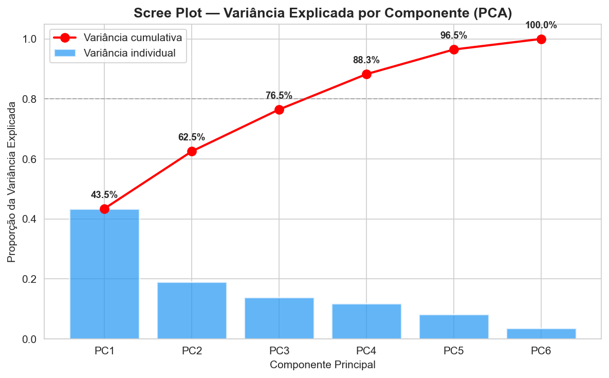

A projeção PCA colorida pelos rótulos originais (RiskLevel) revela que os grupos de risco apresentam **sobreposição considerável** no espaço bidimensional, com pontos de *high risk* tendendo a se concentrar na região de valores positivos de PC1, enquanto *low risk* tende para valores negativos. Essa sobreposição sugere que a separação entre os níveis de risco não é trivial e representa um desafio real para os algoritmos de clusterização.

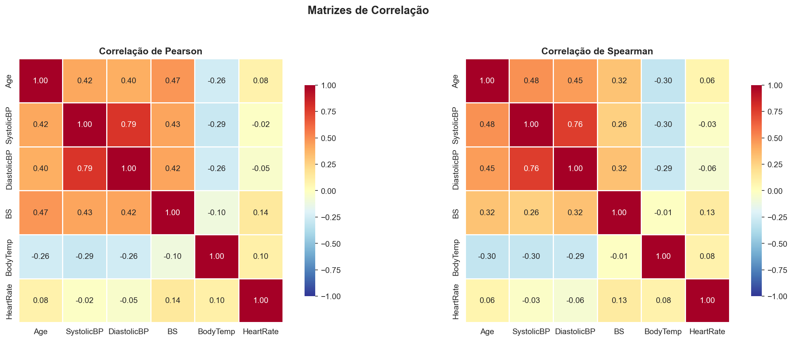

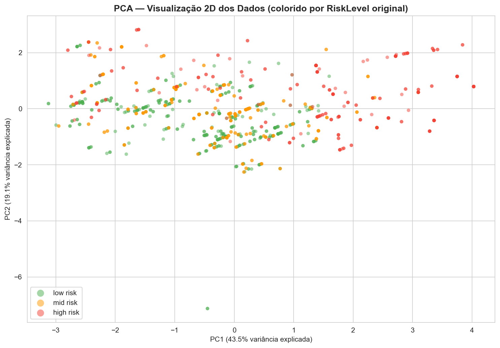

---

## 3. Pré-processamento

### 3.1 Tratamento de Valores Faltantes

O dataset **não possui valores faltantes (NaN)** em nenhuma das colunas. Nenhum tratamento de imputação foi necessário.

### 3.2 Remoção de Outliers Extremos (Erros de Digitação)

Foram identificados **2 registros** com `HeartRate = 7 bpm`, um valor fisiologicamente impossível para seres humanos (a frequência cardíaca mínima viável em repouso é cerca de 40–50 bpm). Ambos os registros pertencem a uma gestante de 16 anos com as mesmas características (provavelmente o mesmo registro duplicado):

| Age | SystolicBP | DiastolicBP | BS | BodyTemp | HeartRate | RiskLevel |
|---|---|---|---|---|---|---|
| 16 | 120 | 75 | 7.9 | 98.0 | 7 | low risk |
| 16 | 120 | 75 | 7.9 | 98.0 | 7 | low risk |

Esses registros foram **removidos do dataset** por serem claramente erros de digitação (provavelmente o valor correto seria 70 ou 77 bpm). Restaram **1.012 registros** após a remoção.

### 3.3 Tratamento de Outliers via IQR

Para as demais variáveis, foi aplicado o método de **clipping baseado no Intervalo Interquartil (IQR)**, que limita os valores ao intervalo [Q1 − 1.5 × IQR, Q3 + 1.5 × IQR]:

| Variável | Limite Inferior | Limite Superior | Outliers Tratados |
|---|---|---|---|
| Age | -11.00 | 69.00 | 1 |
| SystolicBP | 70.00 | 150.00 | 10 |
| DiastolicBP | 27.50 | 127.50 | 0 |
| BS | 5.25 | 9.65 | 210 |
| BodyTemp | 98.00 | 98.00 | 210 |
| HeartRate | 55.00 | 95.00 | 0 |

**Decisões e justificativas:**
- **BS (210 outliers):** A grande quantidade de outliers reflete a assimetria extrema da distribuição de glicose. Valores acima de 9.65 mmol/L foram clipados, não removidos, para preservar a informação de que essas gestantes tinham glicose elevada sem distorcer as distâncias euclidianas usadas pelos algoritmos.
- **BodyTemp (210 outliers):** Com IQR = 0 (Q1 = Q3 = 98), todos os valores acima de 98 são tecnicamente "outliers" pelo método IQR. O clipping padronizou esses valores, mas é importante notar que a variável perde variabilidade após o tratamento, tornando-se efetivamente constante. Após a padronização com StandardScaler, o desvio padrão de BodyTemp aproxima-se de zero, o que significa que **essa variável contribui minimamente para o clustering**. Essa limitação é inerente à baixa variância original da feature.
- O **clipping** foi preferido à remoção para não reduzir excessivamente o tamanho do dataset.

### 3.4 Remoção do Rótulo

A coluna `RiskLevel` foi removida do DataFrame **antes de qualquer etapa de modelagem**. Os rótulos foram salvos em uma variável separada para uso exclusivo na etapa de interpretação posterior.

### 3.5 Padronização

Foi aplicado o **StandardScaler** do scikit-learn, que transforma cada variável para média 0 e desvio padrão 1. Essa padronização é essencial para algoritmos baseados em distância (K-Means, DBSCAN) e para o cálculo de métricas como Silhouette Score, garantindo que variáveis com escalas maiores (como SystolicBP: 70–160) não dominem variáveis com escalas menores (como BS: 6–19).

### 3.6 PCA para Visualização

Após o pré-processamento e padronização, o PCA foi recalculado sobre os dados tratados:
- **PC1:** 47.4% da variância
- **PC2:** 22.7% da variância
- **Total:** 70.1% da variância (melhoria em relação aos 62.5% pré-tratamento, indicando que o tratamento de outliers tornou os dados mais estruturados)

---

## 4. Modelagem

Três algoritmos de clusterização foram implementados com o scikit-learn, cada um testado com diferentes hiperparâmetros. As métricas de avaliação utilizadas foram:

- **Silhouette Score:** Mede a coesão intra-cluster e separação inter-cluster. Valores próximos de 1 indicam clusters bem separados. Intervalo: [-1, 1].
- **Davies-Bouldin Index (DBI):** Mede a razão entre dispersão intra-cluster e distância inter-cluster. Valores menores indicam clusters melhores. Intervalo: [0, ∞).
- **Calinski-Harabasz Score (CHI):** Razão entre variância inter-cluster e intra-cluster. Valores maiores indicam clusters mais densos e bem separados.

### 4.1 K-Means

O K-Means foi testado com K = {2, 3, 4, 5} e métodos de inicialização `k-means++` e `random`.

| K | Init | Silhouette | Davies-Bouldin | Calinski-Harabasz |
|---|---|---|---|---|
| 2 | k-means++ | 0.3123 | 1.3064 | 467.60 |
| 2 | random | 0.3123 | 1.3064 | 467.60 |
| **3** | **k-means++** | **0.3148** | **1.2216** | **484.40** |
| 3 | random | 0.3148 | 1.2216 | 484.40 |
| 4 | k-means++ | 0.3110 | 1.3429 | 421.06 |
| 4 | random | 0.3112 | 1.3430 | 421.23 |
| 5 | k-means++ | 0.2842 | 1.2604 | 381.86 |
| 5 | random | 0.2839 | 1.2614 | 381.86 |

**Melhor configuração:** K=3, init=k-means++ (Silhouette = 0.3148, DBI = 1.2216, CHI = 484.40)

**Análise:** O método do cotovelo sugere um ponto de inflexão em K=3, coerente com o número real de classes de risco. O método de inicialização (`k-means++` vs `random`) não produziu diferenças significativas, indicando boa estabilidade do algoritmo. O Silhouette Score relativamente baixo (0.31) reflete a sobreposição natural entre os grupos de risco observada na EDA.

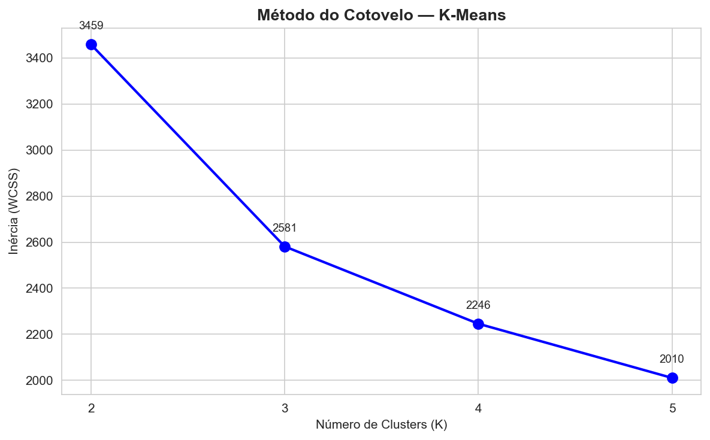

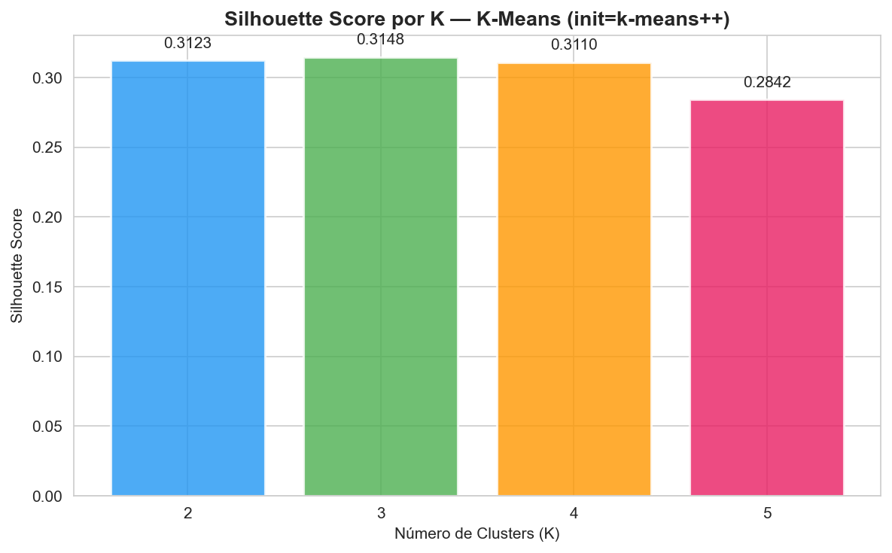

### 4.2 Agglomerative Clustering

O Agglomerative Clustering foi testado com n_clusters = {2, 3, 4, 5} e linkage = {ward, complete, average, single}.

| n_clusters | Linkage | Silhouette | Davies-Bouldin | Calinski-Harabasz |
|---|---|---|---|---|
| **2** | **ward** | **0.3399** | **1.1177** | **394.21** |
| 2 | complete | 0.2188 | 1.7363 | 279.02 |
| 2 | average | 0.3380 | 1.1396 | 402.41 |
| 2 | single | 0.1384 | 0.7698 | 1.50 |
| 3 | ward | 0.2956 | 1.2849 | 447.63 |
| 3 | complete | 0.1783 | 1.8189 | 223.42 |
| 3 | average | 0.2683 | 1.0738 | 231.68 |
| 3 | single | 0.0845 | 0.7709 | 1.50 |
| 4 | ward | 0.2975 | 1.2289 | 392.79 |
| 4 | complete | 0.2296 | 1.6429 | 255.25 |
| 4 | average | 0.3071 | 1.1002 | 351.93 |
| 4 | single | 0.0751 | 0.7323 | 2.53 |
| 5 | ward | 0.3022 | 1.1699 | 354.94 |
| 5 | complete | 0.2523 | 1.3496 | 310.79 |
| 5 | average | 0.2872 | 1.0829 | 271.05 |
| 5 | single | 0.0611 | 0.6985 | 2.60 |

**Melhor configuração:** n_clusters=2, linkage=ward (Silhouette = 0.3399, DBI = 1.1177, CHI = 394.21)

**Análise:** O linkage `ward` consistentemente obteve os melhores resultados, o que é esperado por minimizar a variância total dentro dos clusters. O linkage `single` apresentou desempenho significativamente inferior, com Silhouette próximos de 0, indicando clusters degenerados (efeito de encadeamento). É notável que o melhor resultado foi com **2 clusters**, sugerindo que a separação mais natural nos dados é binária (risco elevado vs. não-elevado).

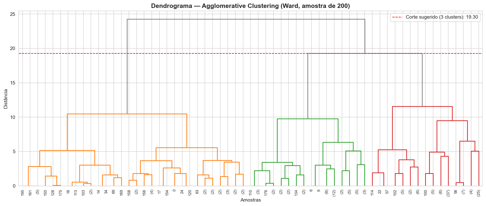

### 4.3 DBSCAN

O DBSCAN foi testado com eps = {0.3, 0.5, 0.7, 1.0, 1.5} e min_samples = {3, 5, 10, 15}.

| eps | min_samples | Clusters | Ruído | Silhouette | Davies-Bouldin | Calinski-Harabasz |
|---|---|---|---|---|---|---|
| 0.3 | 3 | 117 | 230 | 0.7864 | 0.2836 | 1308.31 |
| 0.3 | 5 | 72 | 380 | 0.7713 | 0.3124 | 1473.74 |
| 0.3 | 10 | 16 | 757 | 0.8220 | 0.2641 | 2704.36 |
| 0.3 | 15 | 5 | 886 | 0.8901 | 0.2041 | 5305.39 |
| 0.5 | 3 | 94 | 157 | 0.6280 | 0.4818 | 328.70 |
| 0.5 | 5 | 63 | 262 | 0.6159 | 0.5170 | 388.25 |
| 0.5 | 10 | 26 | 533 | 0.6419 | 0.5071 | 671.29 |
| 0.5 | 15 | 11 | 720 | 0.6291 | 0.6018 | 677.47 |
| 0.7 | 3 | 65 | 83 | 0.3812 | 0.6163 | 102.95 |
| 0.7 | 5 | 46 | 152 | 0.3804 | 0.6411 | 124.72 |
| 0.7 | 10 | 20 | 332 | 0.4204 | 0.6885 | 227.70 |
| 0.7 | 15 | 12 | 463 | 0.3938 | 0.7984 | 210.75 |
| 1.0 | 3 | 18 | 25 | 0.0315 | 0.7736 | 49.70 |
| 1.0 | 5 | 14 | 38 | 0.0315 | 0.8042 | 62.04 |
| 1.0 | 10 | 9 | 105 | 0.0876 | 0.9009 | 94.54 |
| 1.0 | 15 | 6 | 188 | 0.2321 | 0.9197 | 105.54 |
| 1.5 | 3 | 1 | 2 | N/A | N/A | N/A |
| 1.5 | 5 | 1 | 2 | N/A | N/A | N/A |
| 1.5 | 10 | 1 | 4 | N/A | N/A | N/A |
| 1.5 | 15 | 1 | 4 | N/A | N/A | N/A |

**Seleção do melhor modelo:** Para o DBSCAN, a seleção do "melhor" modelo requer cuidado especial. Configurações com eps muito pequeno (ex: eps=0.3, min_samples=15) geram Silhouette Score artificialmente alto (0.89) ao classificar **87.5% dos dados como ruído**, agrupando apenas os pontos mais densos. Embora matematicamente superior, um modelo que descarta a vasta maioria dos dados **não possui utilidade prática** para estratificação de risco.

Para obter um modelo com utilidade clínica, aplicou-se uma **restrição de cobertura mínima**: apenas configurações com ≤50% de pontos classificados como ruído foram consideradas.

**Melhor configuração (com restrição de cobertura):** eps=0.3, min_samples=3 (Silhouette = 0.7864, DBI = 0.2836, CHI = 1308.31, 117 clusters, 230 pontos de ruído = 22.7%)

**Análise crítica do DBSCAN:** Mesmo com a restrição de cobertura, o DBSCAN não é adequado para este dataset. A configuração selecionada (eps=0.3, min_samples=3) gera **117 microclusters** — uma fragmentação excessiva que impede qualquer interpretação clínica significativa. O K-Distance Plot revela que o dataset não possui uma estrutura de densidade claramente definida com regiões de baixa densidade separando grupos distintos, o que torna o DBSCAN inadequado para este problema específico.

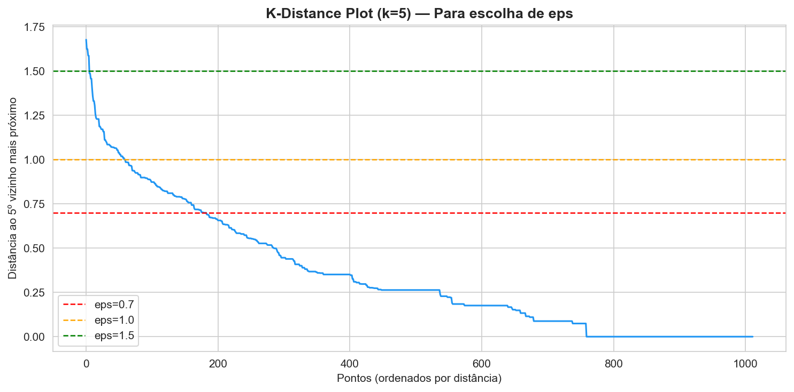

---

## 5. Avaliação Comparativa

### 5.1 Tabela Comparativa dos Melhores Modelos

| Algoritmo | Melhor Configuração | Silhouette | Davies-Bouldin | Calinski-Harabasz |
|---|---|---|---|---|
| **K-Means** | K=3, init=k-means++ | 0.3148 | 1.2216 | 484.40 |
| **Agglomerative** | n_clusters=2, linkage=ward | 0.3399 | 1.1177 | 394.21 |
| **DBSCAN** | eps=0.3, min_samples=3 | 0.7864* | 0.2836* | 1308.31* |

> *Valores do DBSCAN elevados pela natureza do algoritmo (microclusters densos com exclusão de 22.7% dos dados como ruído). Não diretamente comparáveis com K-Means e Agglomerative, que classificam todos os pontos.

### 5.2 Discussão Comparativa

**K-Means vs. Agglomerative:** Os resultados de ambos os algoritmos são próximos em termos de Silhouette (0.31 vs. 0.34), o que é esperado dado que ambos utilizam distâncias euclidianas. O Agglomerative com 2 clusters obteve Silhouette ligeiramente superior, sugerindo que a separação binária (risco elevado vs. não-elevado) é mais nítida do que a ternária. No entanto, o K-Means com K=3 apresentou melhor Calinski-Harabasz (484 vs. 394), indicando que, apesar de mais difusa, a separação em 3 grupos captura mais variância inter-cluster.

**DBSCAN:** Conforme discutido na Seção 4.3, o DBSCAN não é adequado para este dataset. A estrutura dos dados não apresenta clusters de densidade uniforme claramente separados por regiões de baixa densidade — premissa fundamental do DBSCAN. Os dados se distribuem de forma mais difusa e contínua no espaço de features, favorecendo algoritmos baseados em partição (K-Means) ou hierarquia (Agglomerative).

**Conclusão da avaliação:** Para fins práticos de estratificação de risco materno, o **K-Means com K=3** é o modelo mais adequado, pois (1) classifica todas as instâncias, (2) gera 3 clusters alinhados ao número real de níveis de risco, e (3) apresenta métricas competitivas considerando a complexidade intrínseca do problema.

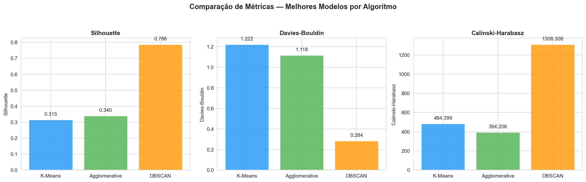

---

## 6. Interpretação dos Clusters

### 6.1 K-Means (K=3) — Melhor modelo para interpretação

Após a clusterização, os rótulos originais (`RiskLevel`) foram reintroduzidos para avaliar a correspondência entre os clusters encontrados e os níveis reais de risco.

#### Tabela de Contingência (Cluster × RiskLevel)

| Cluster | High Risk | Low Risk | Mid Risk | Total |
|---|---|---|---|---|
| 0 | **157 (77.0%)** | 9 (4.4%) | 38 (18.6%) | 204 |
| 1 | 59 (18.8%) | **160 (51.1%)** | 94 (30.0%) | 313 |
| 2 | 56 (11.3%) | **235 (47.5%)** | 204 (41.2%) | 495 |
| **Total** | 272 | 404 | 336 | 1012 |

#### Perfil Médio de Cada Cluster

| Cluster | Age | SystolicBP | DiastolicBP | BS | BodyTemp | HeartRate |
|---|---|---|---|---|---|---|
| 0 | 45.07 | 130.39 | 89.83 | 9.50 | 98.0 | 77.13 |
| 1 | 21.81 | 90.33 | 60.96 | 7.48 | 98.0 | 75.99 |
| 2 | 28.76 | 120.34 | 80.76 | 7.13 | 98.0 | 72.34 |

#### Análise dos Clusters

- **Cluster 0 (n=204) — Perfil de Alto Risco:** Este cluster capturou **77.0% de gestantes high risk**, com perfil caracterizado por idade elevada (média 45 anos), pressão arterial sistólica alta (130 mmHg), diastólica alta (90 mmHg) e glicose elevada (9.5 mmol/L). Este é o cluster mais "puro" e demonstra que o algoritmo conseguiu identificar o subgrupo de maior risco com boa precisão. Do ponto de vista clínico, o perfil é consistente com pré-eclâmpsia (PA ≥ 140/90) e diabetes gestacional (glicemia elevada), **confirmando a hipótese H2**.

- **Cluster 1 (n=313) — Perfil de Baixo Risco:** Concentra **51.1% de gestantes low risk**, com perfil de jovens (média 22 anos), pressão baixa (90/61 mmHg) e glicose normal (7.48 mmol/L). Porém, contém também 30% de mid risk, indicando sobreposição.

- **Cluster 2 (n=495) — Perfil Misto (Risco Médio/Baixo):** O maior cluster, com distribuição quase equilibrada entre low (47.5%) e mid (41.2%) risk. Perfil intermediário com pressão 120/81 e glicose 7.13. Esse cluster revela que **low risk e mid risk são os mais difíceis de separar**, possivelmente porque as diferenças fisiológicas entre esses níveis são mais sutis.

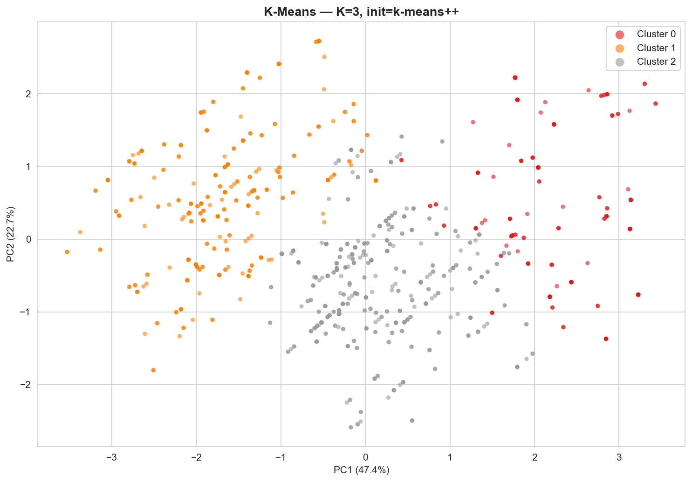

### 6.2 Agglomerative (n_clusters=2) — Separação binária

| Cluster | High Risk | Low Risk | Mid Risk | Total |
|---|---|---|---|---|
| 0 | 124 (15.0%) | **400 (48.4%)** | 302 (36.6%) | 826 |
| 1 | **148 (79.6%)** | 4 (2.2%) | 34 (18.3%) | 186 |

O Agglomerative com 2 clusters confirma que a separação mais natural nos dados é **binária**: um grupo de risco elevado (Cluster 1, com 79.6% de high risk) versus o restante. Esse resultado corrobora a dificuldade de separar low e mid risk observada no K-Means.

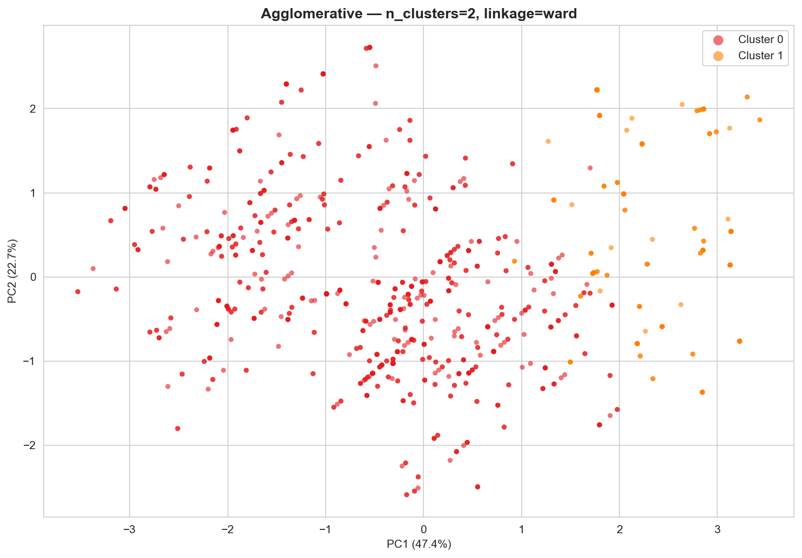

### 6.3 DBSCAN — Análise limitada

O DBSCAN com eps=0.3 e min_samples=3 gerou 117 microclusters e classificou 230 registros (22.7%) como ruído. A fragmentação excessiva torna a interpretação prática inviável. Os microclusters formados capturam subgrupos hiperlocais no espaço de features, sem poder de generalização clínica.

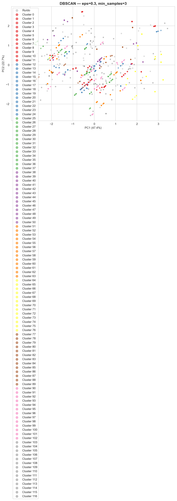

### 6.4 Síntese da Interpretação

Os resultados demonstram que:

1. **O K-Means com K=3 consegue identificar com boa acurácia o grupo de alto risco** (77% de pureza no Cluster 0), **confirmando parcialmente a hipótese H1** e **confirmando a hipótese H2**.

2. **A separação entre low risk e mid risk é significativamente mais difícil**, com os clusters 1 e 2 apresentando alta mistura. Isso sugere que os critérios clínicos para diferenciar esses dois níveis envolvem informações que vão além das 6 métricas fisiológicas disponíveis (possivelmente histórico médico, exames complementares, etc.). A hipótese H1 é, portanto, **parcialmente refutada**: os algoritmos conseguem identificar alto risco, mas não conseguem separar adequadamente baixo e médio risco.

3. **A estrutura natural dos dados é mais próxima de uma separação binária** (alto risco vs. não-alto risco), como evidenciado pelo Agglomerative com 2 clusters.

4. **O DBSCAN não é adequado** para este tipo de dado, que não apresenta clusters de densidade claramente distintas.

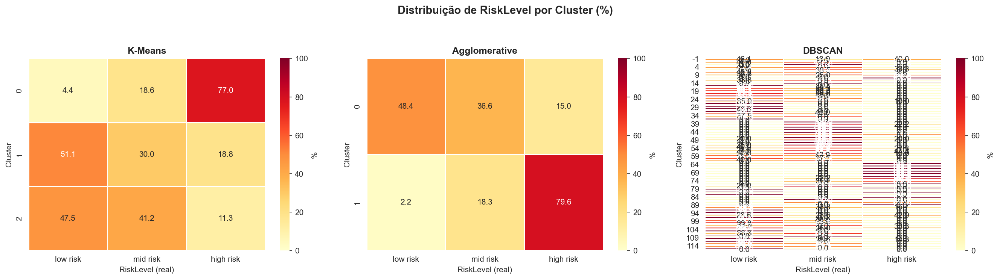

---

## 7. Conclusão

Este trabalho investigou se algoritmos de clusterização não supervisionada conseguem agrupar gestantes em perfis de risco utilizando exclusivamente métricas fisiológicas. Os três algoritmos testados — K-Means, Agglomerative Clustering e DBSCAN — revelaram padrões importantes:

O **K-Means com K=3** demonstrou ser o mais adequado para a tarefa, conseguindo isolar um cluster de alto risco com **77% de pureza**, com perfil clínico coerente: gestantes mais velhas, com pressão arterial e glicemia elevadas. Esse resultado valida parcialmente a tese de que existem padrões fisiológicos naturais que distinguem os níveis de risco, **confirmando a hipótese H2** (alto risco é o mais distinguível) e **parcialmente confirmando H1** (três agrupamentos são formados, mas com sobreposição entre baixo e médio risco).

A **principal limitação** observada é a dificuldade de separar gestantes de baixo e médio risco, cujas métricas fisiológicas apresentam sobreposição considerável. Isso sugere que a classificação completa em três níveis requer informações além das métricas disponíveis neste dataset.

O **DBSCAN** mostrou-se inadequado para dados com distribuição contínua e sem regiões de baixa densidade claramente definidas, enquanto o **Agglomerative Clustering** confirmou que a separação binária (alto risco vs. demais) é a fronteira mais nítida nos dados.

Em resumo, os algoritmos de clusterização não supervisionada **são eficazes para identificar o perfil de alto risco materno**, mas insuficientes para uma estratificação completa em três níveis sem informações clínicas adicionais.

---

## Referências

- Ahmed, M., Kashem, M.A., Rahman, M., & Khatun, S. (2020). *Review and Analysis of Risk Factor of Maternal Health in Remote Area Using the Internet of Things (IoT)*. InECCE2019, Lecture Notes in Electrical Engineering, vol 632, Springer.
- Pedregosa, F. et al. (2011). *Scikit-learn: Machine Learning in Python*. Journal of Machine Learning Research, 12, pp. 2825-2830.
- Rousseeuw, P.J. (1987). *Silhouettes: A graphical aid to the interpretation and validation of cluster analysis*. Journal of Computational and Applied Mathematics, 20, pp. 53-65.
- Davies, D.L., & Bouldin, D.W. (1979). *A cluster separation measure*. IEEE Transactions on Pattern Analysis and Machine Intelligence, 1(2), pp. 224-227.
